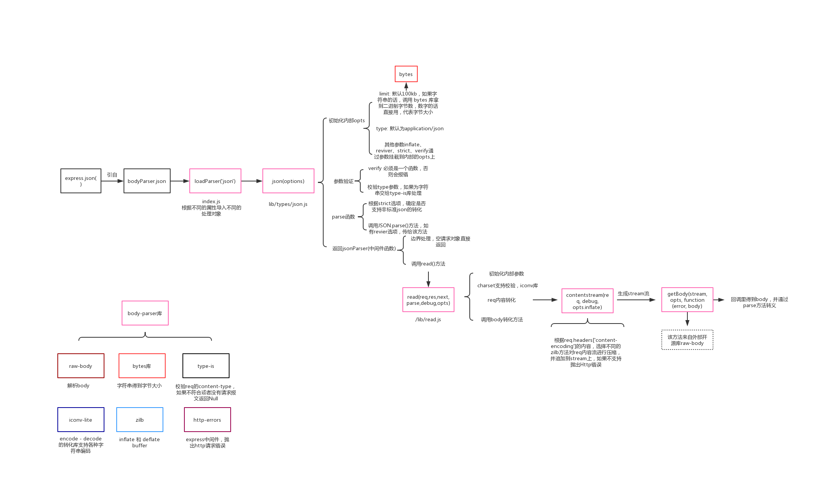

# 三、内置中间件

## express.json()

express.json() 是Express内部的json解析中间件，它的作用是获取post请求的Json数据，并在req.body()中拿到，用法如下：
```
  app.use(express.json({
    limit: '120kb',
    inflate: false
  }))

  app.post('/login', (req, res) => {
    res.send(console.log(req.body))
  })
  // 如果没有用该中间件的话，req.body 为undefined
```

首先中间件是一个函数，可以传入三个参数，基本结构如下：
```
  function (res,res, next) {
    // 处理req | res
  }
```
猜想express.json() 应该返回的也是这么一个类似的函数。

#### body-parser 源码分析

github仓库地址在 https://github.com/expressjs/body-parser

入口文件在 lib/index.js下：

```
  Object.defineProperty(exports, 'json', {
    configurable: true,
    enumerable: true,
    get: createParserGetter('json')
  })
```
看到这里就知道为何可以使用express.json()了，这里访问express.json()其实是调用了createParserGetter('json')方法。

```
  function createParserGetter (name) {
    return function get () {
      return loadParser(name)
    }
  }

  function loadParser (parserName) {
    var parser = parsers[parserName]

    if (parser !== undefined) {
      return parser
    }

    // 引用不同的文件
    switch (parserName) {
      case 'json':
        parser = require('./lib/types/json')
        break
      case 'raw':
        parser = require('./lib/types/raw')
        break
      case 'text':
        parser = require('./lib/types/text')
        break
      case 'urlencoded':
        parser = require('./lib/types/urlencoded')
        break
    }

    // 缓存require避免重复引入
    return (parsers[parserName] = parser)
  }

```
createParserGetter最后引入了不同的文件，express.json()的核心指向了./lib/types/json文件，代码如下：

```
  function json (options) {
    // 传入的选项进行初始化
    var opts = options || {}

    var limit = typeof opts.limit !== 'number'
      ? bytes.parse(opts.limit || '100kb')
      : opts.limit
    var inflate = opts.inflate !== false
    var reviver = opts.reviver
    var strict = opts.strict !== false
    var type = opts.type || 'application/json'
    var verify = opts.verify || false

    // verify 选项必须是函数
    if (verify !== false && typeof verify !== 'function') {
      throw new TypeError('option verify must be function')
    }

    // type 可以是MIME类型，直接丢给 typeis 处理
    var shouldParse = typeof type !== 'function'
    ? typeChecker(type)
    : type
    ...
  }
```
以上这段代码主要数对传入的options进行初始化。

```
  function json (options) {
    var opts = options || {}
    ...
    function parse (body) {
      if (body.length === 0) {
        // special-case empty json body, as it's a common client-side mistake
        // TODO: maybe make this configurable or part of "strict" option
        return {}
      }

      if (strict) {
        var first = firstchar(body)

        if (first !== '{' && first !== '[') {
          debug('strict violation')
          throw createStrictSyntaxError(body, first)
        }
      }

      try {
        debug('parse json')
        return JSON.parse(body, reviver)
      } catch (e) {
        throw normalizeJsonSyntaxError(e, {
          message: e.message,
          stack: e.stack
        })
      }
    }
  }
```
parse方法 主要用来转化JSON的，JSON字符串转化为JSON对象，可以学习下错误处理方式。特别要注意 reviver 是从options传进来的。是 JSON.parse() 方法的第二个参数。它会被传入到接下来的read()方法里。
```
  function json (options) {
    // 传入的选项进行初始化
    var opts = options || {}

    return function jsonParser (req, res, next) {
      // 从缓存取，取到跳过
      if (req._body) {
        debug('body already parsed')
        next()
        return
      }
      // 创建 req.body 属性
      req.body = req.body || {}

      // 跳过空的请求对象
      if (!typeis.hasBody(req)) {
        debug('skip empty body')
        next()
        return
      }

      debug('content-type %j', req.headers['content-type'])

      // 调用 typeis 判断是否需要转化
      if (!shouldParse(req)) {
        debug('skip parsing')
        next()
        return
      }

      // 获取charset，如果不是 utf- 开头抛错
      var charset = getCharset(req) || ' -8'
      if (charset.substr(0, 4) !== 'utf-') {
        debug('invalid charset')
        next(createError(415, 'unsupported charset "' + charset.toUpperCase() + '"', {
          charset: charset,
          type: 'charset.unsupported'
        }))
        return
      }

      /**
      * options 传入到 read() 函数里
      */
      read(req, res, next, parse, debug, {
        encoding: charset,
        inflate: inflate,
        limit: limit,
        verify: verify
      })
    }
  }
```
不出所料，确认返回了这么一个中间件函数。这段代码先是从req._body取值，取到的话就执行下一个中间件，可以猜想转化完成之后会把数据挂载到req._body缓存起来。然后进行了一些边界处理，如跳过空的请求对象，将请求类型交给 typeis 看返回值是否需要处理JSON，判断charset是否已utf-开头，在判断charset的时候调用了外部的 content-type 库。这段代码的核心在 read 方法，我们看下read里面做了什么。

./lib/read.js
```
  function read (req, res, next, parse, debug, options) {
    var length
    var opts = options
    var stream

    // 是否转化过的标志
    req._body = true

    // 初始化传入的option
    var encoding = opts.encoding !== null
      ? opts.encoding
      : null
    var verify = opts.verify

    try {
      stream = contentstream(req, debug, opts.inflate)
      length = stream.length
      // 这句是干啥的 为何要置为 undefined 
      stream.length = undefined
    } catch (err) {
      return next(err)
    ...
  }
``` 
以上代码主要做了两件事情，1、初始化参数，我们看到 req._body 在这里置为了true，和我们原先的猜想一致，类似于一种锁的机制。2、通过 contentstream 方法将req对象转化为内容流。我们看一下 contentstream 的代码。

```
  function contentstream (req, debug, inflate) {
    var encoding = (req.headers['content-encoding'] || 'identity').toLowerCase()
    var length = req.headers['content-length']
    var stream

    debug('content-encoding "%s"', encoding)

    // 根据请求头中的编码格式决定采用哪种方式进行编码
    if (inflate === false && encoding !== 'identity') {
      throw createError(415, 'content encoding unsupported', {
        encoding: encoding,
        type: 'encoding.unsupported'
      })
    }

    // 调用不同的库对req进行压缩，目前只支持两种压缩格式 deflate 和 gzip 最后拿到 stream
    switch (encoding) {
      case 'deflate':
        stream = zlib.createInflate()
        debug('inflate body')
        // req转化成流数据，追加到 stream 上
        req.pipe(stream)
        break
      case 'gzip':
        stream = zlib.createGunzip()
        debug('gunzip body')
        req.pipe(stream)
        break
      case 'identity':
        stream = req
        stream.length = length
        break
      default:
        throw createError(415, 'unsupported content encoding "' + encoding + '"', {
          encoding: encoding,
          type: 'encoding.unsupported'
        })
    }

    return stream
  }
```
contentstream 方法会根据 req.headers['content-encoding'] 的值采用不同的方式对req的内容进行编码。如果 identity 的话代表默认，不进行任何编码。

```
  // 调用getBody，拿到body的内容，关键还是在 getBody -> 源于另一个开源库 raw-body
  getBody(stream, opts, function (error, body) {
    console.log(body)
    if (error) {
      var _error

      if (error.type === 'encoding.unsupported') {
        // echo back charset
        _error = createError(415, 'unsupported charset "' + encoding.toUpperCase() + '"', {
          charset: encoding.toLowerCase(),
          type: 'charset.unsupported'
        })
      } else {
        // set status code on error
        _error = createError(400, error)
      }

      // read off entire request
      stream.resume()
      onFinished(req, function onfinished () {
        next(createError(400, _error))
      })
      return
    }

    // verify
    if (verify) {
      try {
        debug('verify body')
        verify(req, res, body, encoding)
      } catch (err) {
        next(createError(403, err, {
          body: body,
          type: err.type || 'entity.verify.failed'
        }))
        return
      }
    }

    // parse
    var str = body
    try {
      debug('parse body')
      str = typeof body !== 'string' && encoding !== null
        ? iconv.decode(body, encoding)
        : body
      req.body = parse(str)
    } catch (err) {
      next(createError(400, err, {
        body: str,
        type: err.type || 'entity.parse.failed'
      }))
      return
    }

    next()
  })
```
该中间件最终调用了第三方库 raw-body 进行了拿到请求body，最后通过JSON.parse()拿到请求对象。

#### 总结



## express.static()

## express.Router()

## express.urlencoded()